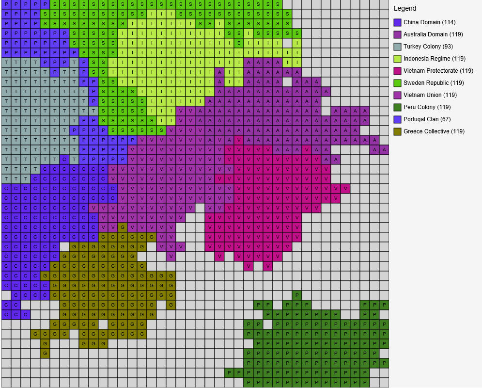
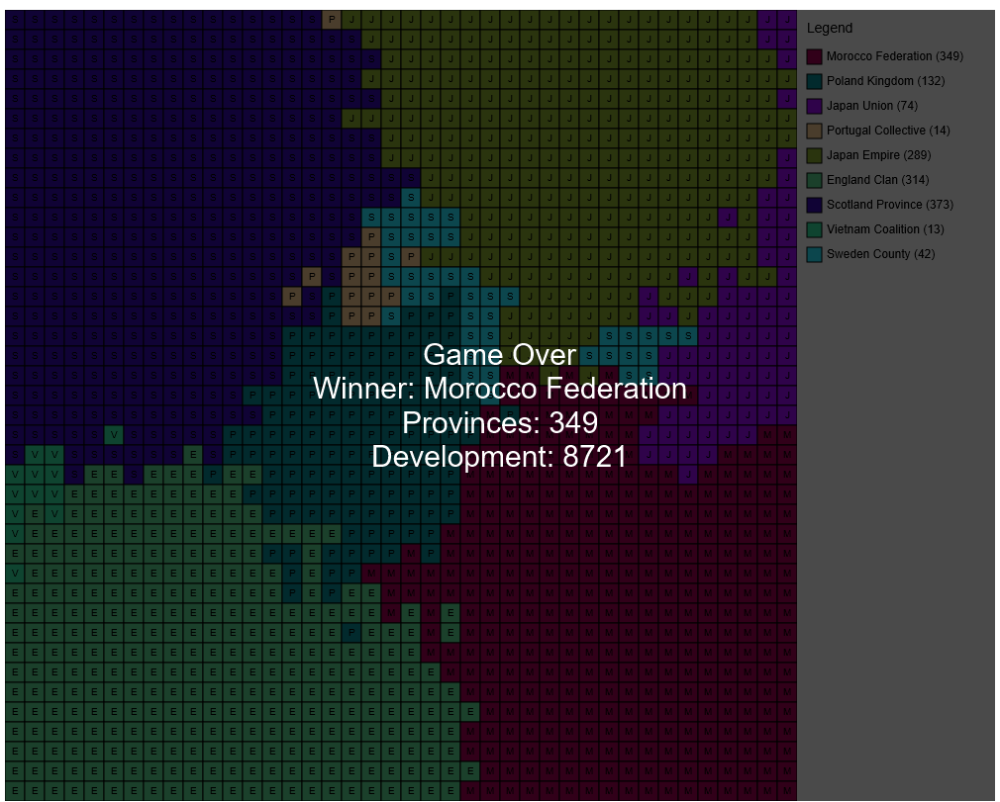

# Mini Universalis

Team Members:

    Names: Ethan Kissell, Achintya Kumar

---

## Description 

Mini Universalis is a self playing game inspired by Polymorphia. It runs a simulation on a 2D grid of `Province` tiles populated by randomly seeded `Nations`. Nations expand, develop, and fight until only one remains or a stalemate is detected. 

### Visual Simulation

The game features a JavaFX-based graphical user interface that visualizes the simulation in real-time.




*   **Grid Visualization:** The map is rendered as a grid of colored squares, each representing a province.
*   **Nation Colors:** Each nation is assigned a unique color based on its name hash.
*   **Real-time Updates:** The map updates automatically as the simulation progresses.
*   **Legend:** A legend on the right side shows the active nations and their province counts.

### Current Implementation

* The map is an X*Y grid of `Province` objects. Provinces have a *development* value, which is a configurable constant, and an owning `Nation`, or null.
* Nations are seeded on random empty provinces at game startup. Each nation keeps a list of it provinces and an *army* as an integer.
* Army capacity and growth are driven by a nation's total development:
  * Army cap = `ARMY_CAP_MODIFIER * total_development`, constant is currently set at **8**.
  * Each turn a nation grows its army by `total_development * ARMY_GROWTH_MODIFIER`, bounded by the cap and constant is set at **5**.
* Battles compare nation armies. After any battle both sides' armies are halved, with integer division.
  * Capture only happens when the attacker's army is larger than the defender's; ties halve both armies, but there is no transfer of ownership.
* Provinces gain development point during `distributeDevelopmentPoints()` each turn. The current value is `province_count / 2` points per nation. 
  * Province development is locked between **0** and **25**.
* Nations choose their actions each turn based on local conditions; empty neighbors, relative army size, and a low-army threshold; and employ *Offensive* or *Defensive*.

### Game Rules

* **Province**
  * `development` is an integer bounded in a range of constants, right now **0** to **25**.
  * Starting development is chosen as `MIN_DEV + random.nextInt(MAX_STARTING_DEV)` and is locked between `MIN_DEV...MAX_DEV`.
  * When a province is captured its development is reduced by a small penalty constant.

* **Nation**
  * Owns a list of `Province`s and an `army` integer
  * Initial army is set to the nation's `total_development` immediately after seeding
  * Army cap is `ARMY_CAP_MODIFIER * total_development`.
  * Army growth per turn is `total_development * ARMY_GROWTH_MODIFIER` and bounded by the cap.
  * Battle rules: when attempting to capture an enemy province:
    * If attacker army > defender army then attacker captures province; both armies are halved.
    * If attacker army < defender army then no capture; both armies are halved.
    * Tie then both armies are halved and no transfer.
  * Low army defensive threshold: nations switch to defensive strategy when their army is < 20% of cap, or when total development is zero.
  * Opportunistic behavior: a nation will attempt opportunistic captures if it detects an adjacent enemy nation with lower army.

* **Turn order**
  * Each turn: all nations take their turn, sequentially, `distributeDevelopmentPoints()` runs, the map is checked for eliminated nations, and the game checks for stalemates/termination conditions.

* **Termination**
  * The game ends when only one nation remains or a stalemate, idle-turns threshold, is reached. The code prints map snapshots and a summary to stdout.

---

## Project Structure

```
src/main/java
└─ universalis
   ├─ Universalis.java              # main game logic
   ├─ ui/
   │  ├─ GameApplication.java        # JavaFX application entry point
   │  └─ Launcher.java               # Launcher for JavaFX
   ├─ map/
   │  ├─ Map.java                    # grid + Map.Builder
   │  ├─ Province.java               # tile with development and owner
   │  ├─ Nation.java                 # nation/army behavior and action logic
   │  └─ factory/
   │     ├─ ProvinceFactory.java
   │     └─ NationFactory.java       # randomized name pool + used-names protection
   └─ strategy/
      ├─ Strategy.java               # strategy interface
      ├─ NoOpStrategy.java
      ├─ DefensiveStrategy.java
      └─ OffensiveStrategy.java
```

### Responsibilities

* `Universalis`
  * Orchestrates turn loop, seeding, distribution of development points, map snapshots, and termination logic.
  * Provides a helper `setupDefaultGame(size, numNations)` for quick configuration.

* `GameApplication` (UI)
  * Initializes the JavaFX stage and scene.
  * Subscribes to `GameEventBus` to receive game updates.
  * Renders the map and legend on a `Canvas`.

* `Map` + `Map.Builder`
  * Encapsulates the 2D array of `Province`.
  * `Builder.create(size)` / `createNonSquare(xSize,ySize)` and `seedNations(nations)` populate and initialize provinces and initial nation placement.

* `Province`
  * Holds the development value and owner reference.
  * `changeDevelopment(int)` applies bounded changes of either growth/penalty.

* `Nation`
  * Holds provinces, strategy, and army.
  * Implements decision logic to choose offensive/defensive actions each turn and resolves expansions / battles.

* `Strategy` and implementations
  * `Strategy.execute(Nation, Universalis)` is the per-turn action pattern for a nation. Concrete strategies implement behavior; however, the `Nation` currently makes higher-level decisions, switching between strategies, inside `takeTurn()` using local game state.

* `NationFactory`
  * Randomized name generation from a base list and suffix list to produce unique names.

---

## Patterns Used

* **Builder**
  * `Map.Builder` is used for constructing and seeding maps in a readable pipeline.

* **Strategy**
  * `Strategy` interface with concrete strategies, `NoOp`, `Offensive`, `Defensive`, to encapsulate per-turn behavior.

* **Factory**
  * `ProvinceFactory` and `NationFactory` produce objects; provinces, randomized nations; and isolate construction details.

* **Singleton**
  * `GameEventBus` is a singleton used to decouple the game logic from the UI.

* **Observer**
  * The UI observes game events via the `GameEventBus`.
   
---

## Tests

Unit tests are in `src/test/java`. Tests use an in-memory output capture, `ByteArrayOutputStream`, to collect and assert printed simulation traces. Example test scenarios include:

* Single-turn and multi-turn progression tests.
* Small deterministic battle tests to verify capture and army halving.
* Full-game playthroughs.

## How to Run

1. **Run the Simulation (UI)**:
   ```bash
   ./gradlew run
   ```
   This will launch the JavaFX window showing the game simulation.

2. **Run Tests**:
   ```bash
   ./gradlew test
   ```
   This executes the unit tests to verify the game logic.
